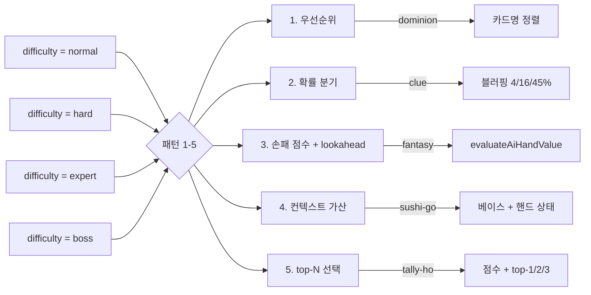

# 🧠 AI 난이도별 행동 패턴 (판타지왕국에서 출발한 8개 게임 공통 가이드)

> `docs/ai-difficulty-system.md` 의 후속 문서.
> NPC 풀 (누가 있나) 다음은 **각 NPC가 무엇을 하느냐**. 5가지 패턴 + 게임별 실제 코드 분석.

판타지왕국(Fantasy Realms 기반)이 원형이고 패턴이 가장 깊게 구현되어 있지만, **이 가이드는 8개 게임 모두에서 공통으로 쓰이는 패턴**을 정리합니다. 새 게임을 만들거나 기존 게임의 난이도 분기를 추가할 때 참조하세요.

---

## 1. 한눈에 보는 5가지 패턴

| # | 패턴 | 대표 게임 | 깊이 |
|---|---|---|---|
| 1 | **점수 기반 우선순위** | [dominion.js](../dominion.js), monopoly.js | ⭐ |
| 2 | **휴리스틱 + 확률 분기** | [clue.js](../clue.js) | ⭐⭐ |
| 3 | **점수 계산 + 1-턴 lookahead** | [script.js](../script.js) (판타지) | ⭐⭐⭐⭐ |
| 4 | **베이스 가중치 + 컨텍스트** | [sushi-go.js](../sushi-go.js) | ⭐⭐⭐ |
| 5 | **점수 함수 + top-N 선택** | [tally-ho.js](../tally-ho.js) | ⭐⭐ |



---

## 2. 표준 도우미: `aiDifficultyKey(player)`

모든 게임 모듈은 동일한 정규화 함수를 사용합니다.

```js
// 판타지왕국 [script.js:4571](../script.js#L4571)
function aiDifficultyKey(player) {
  return AI_DIFFICULTY_LABELS[player?.difficulty] ? player.difficulty : "normal";
}

// 클루 [clue.js:1357](../clue.js#L1357)
function aiDifficultyKey(player) {
  const key = String(player?.difficulty || "normal");
  return AI_PROFILE_DIFFICULTY_KEYS.includes(key) ? key : "normal";
}

// 탈리호 [tally-ho.js:1041](../tally-ho.js#L1041)
function tallyAiDifficultyKey() {
  const difficulty = state.aiDifficulty || state.aiProfile?.difficulty || "normal";
  return AI_DIFFICULTY_LABELS[difficulty] ? difficulty : "normal";
}
```

> **관용**: `difficulty = aiDifficultyKey(player)` 이후 `if (difficulty === "expert")` 로 깊이 분기.

---

## 3. 패턴 1 — 점수 기반 우선순위 (가장 단순)

### 3-1. 어디 쓰나

[dominion.js:815-870](../dominion.js#L815-L870) 처럼 **점수 함수나 행동 공간이 작은 게임**.

### 3-2. 실제 코드

````js
// dominion.js:815-870
function chooseAiAction(player) {
  const actions = player.hand.filter(c => isAction(c));
  if (!actions.length) return null;
  // 카드 점수 우선순위 (도미니언 전략 순서)
  const priority = [
    "Market", "Laboratory", "Festival", "Village", "Smithy",
    "Witch", "Militia", "Mine", "Workshop"
  ];
  for (const name of priority) {
    const card = actions.find(c => c.name === name);
    if (card) return card;
  }
  return actions[0];
}

function chooseAiBuy(player) {
  if (player.buys <= 0) return null;
  // 점수 임계값 + 공급량 분기
  if (player.coins >= 8 && supplyPileLeft("Province") > 0) return "Province";
  if (player.coins >= 6 && supplyPileLeft("Gold") > 0)       return "Gold";
  if (player.coins >= 5 && supplyPileLeft("Duchy") > 0
      && supplyPileLeft("Province") <= 4) return "Duchy";
  // ...
}
````

### 3-3. 동작

- normal / hard / expert 가 **같은 우선순위 배열** 사용
- 난이도 차이는 보통 **노이즈(random) 추가** 또는 **상위 N 분기** 정도

### 3-4. 장단점

| ✅ | ⚠️ |
|---|---|
| 디버깅 쉬움 | 깊이 한계 명확 |
| 도메인 지식만으로 충분 | 난이도 3단계가 거의 동일함 |

---

## 4. 패턴 2 — 휴리스틱 + 확률 분기

### 4-1. 어디 쓰나

**정보 비대칭 + 블러핑**이 핵심인 게임.
[clue.js](../clue.js) 가 모범 사례.

### 4-2. 핵심 헬퍼

````js
// clue.js:1035
function aiHintChance(player, hardChance, expertChance) {
  const difficulty = aiDifficultyKey(player);
  if (difficulty === "normal") return 0;
  return difficulty === "expert" ? expertChance : hardChance;
}
````

> `normal → 0` (보드게임에서는 정상적으로 플레이), `hard/expert → 두 다른 확률`.

### 4-3. 실제 코드 — 난이도별 행동 차이

| 행동 | normal | hard | expert |
|---|---|---|---|
| **`chooseAiRefuteCard`** (반박 카드 선택) | 매치 중 무작위 | suggester 모르는 카드 55% 우선 | 인간이 모르는 카드 우선, 그 다음 suggester 모르는 카드 |
| **`chooseAiDestination`** (이동) | 방 무작위 | hint방 24%, 자체 블러핑 16% | hint방 42%, 자체 블러핑 45% |
| **`chooseAiSuggestionCard`** (추리 카드) | 디코이 14% | 디코이 18%, 자체 블러핑 4% | 디코이 58%, 자체 블러핑 18% |

````js
// clue.js:1516-1530
function chooseAiDestination(player, reachable) {
  const difficulty = aiDifficultyKey(player);
  if (difficulty !== "normal" && hint
      && state.hintDeck.length
      && Math.random() < (difficulty === "expert" ? 0.42 : 0.24)) return hint;

  const bluffChance = difficulty === "expert" ? 0.45
                    : difficulty === "hard" ? 0.16
                    : 0.04;
  if (bluffRooms.length && Math.random() < bluffChance) return randomItem(bluffRooms);

  // ...
}

function chooseAiRefuteCard(target, suggester, matches) {
  if (!matches.length) return null;
  const difficulty = aiDifficultyKey(target);
  if (difficulty === "expert") {
    const humanKnown = matches.filter(e => state.humanKnown.has(e.id));
    if (humanKnown.length) return randomItem(humanKnown);
    const suggesterKnown = matches.filter(e => suggester?.known?.has(e.id));
    if (suggesterKnown.length) return randomItem(suggesterKnown);
  } else if (difficulty === "hard") {
    const suggesterKnown = matches.filter(e => suggester?.known?.has(e.id));
    if (suggesterKnown.length && Math.random() < 0.55) return randomItem(suggesterKnown);
  }
  return randomItem(matches);
}
````

### 4-4. 디자인 결정 노트

| 결정 | 트레이드오프 |
|---|---|
| 정상(normal) 도 `0%` 대신 작은 확률 사용 | 학습된 사람을 위한 warmup |
| hard vs expert 사이 step 큼 | 한 단계에서 다른 단계로 가시적 변화 |
| 같은 행동을 둘 다 활용 | 거의 같은 코드지만 depth 차이가 보임 |

---

## 5. 패턴 3 — 점수 계산 + 1-턴 lookahead (가장 깊음)

### 5-1. 어디 쓰나

판타지왕국 (`script.js`). 5~7장의 손패에서 매수/버리기/특수 카드 효과가 모두 점수에 영향.

### 5-2. 핵심 함수

```js
// 가상의 손패 점수 계산
function evaluateAiHandValue(player, hand, difficulty) {
  // base 점수 + 보너스 + 패널티 + 무효 + 특수 효과 (종합)
  // 깊이 1 lookahead (현재 손패 기준으로 가능한 모든 카드 효과 시뮬레이션)
  return total;
}
```

### 5-3. 실제 코드 — normal vs expert 분기

````js
// script.js:4571-4620: chooseAiDraw
function chooseAiDraw(player) {
  const difficulty = aiDifficultyKey(player);
  if (difficulty === "normal") return chooseNormalAiDraw(player);
  return chooseScoredAiDraw(player, difficulty);
}

function chooseNormalAiDraw(player) {
  // 카드 base 점수만 비교 — 단순
  state.discard.forEach((card, index) => {
    const testHand = [...player.hand, card];
    const discardId = chooseNormalAiDiscard(player, testHand);
    const finalHand = testHand.filter(c => c.id !== discardId);
    const value = scorePlayer(player, finalHand).total
                + (card.base * 0.08)
                + (Math.random() * 1.25);  // ← 노이즈로 다양성
    // ...
  });
}

function chooseScoredAiDraw(player, difficulty) {
  const deckBias = difficulty === "boss" ? 0.5
                 : difficulty === "expert" ? 2
                 : 4;
  // 보너스·패널티·특수 카드 모두 반영
  const value = evaluateAiHandValue(player, finalHand, difficulty);
  // ...
}
````

### 5-4. 다른 함수 분기

| 함수 | normal | hard/expert |
|---|---|---|
| `chooseAiDraw` | 단순 점수 + 노이즈 | `evaluateAiHandValue` (보너스/패널티/특수) |
| `chooseAiDiscard` | 행 단위 점수만 | 손패 전체 점수 비교 |
| `chooseAiGenieCard` (특수 카드) | `card.base` 정렬 | `evaluateAiHandValue` |
| `chooseAiNecromancerCard` | 휴리스틱 | `chooseBestAiActionCandidate` |
| `chooseAiOptionalAction` | 휴리스틱 | 모든 후보 점수 후 최고 |

````js
// script.js:4350 (chooseAiGenieCard)
const difficulty = aiDifficultyKey(player);
if (difficulty === "normal") {
  return [...state.deck]
    .sort((a, b) => b.base - a.base || a.name.localeCompare(b.name, "ko"))[0]
    || null;
}

let bestCard = state.deck[0];
let bestValue = -Infinity;
state.deck.forEach((card) => {
  const value = evaluateAiHandValue(player, [...player.hand, card], difficulty);
  if (value > bestValue) { bestValue = value; bestCard = card; }
});
return bestCard || null;
````

### 5-5. 디자인 결정 노트

| 결정 | 트레이드오프 |
|---|---|
| **1-턴 lookahead** 만 (depth-1) | 점수 함수 한 번 vs N² 호출. 깊이 늘리면 응답 시간 ⬆⬆ |
| `evaluateAiHandValue` 가 손패 점수 함수 재사용 | 코드 중복 ↓, 점수 룰 변경 시 자동 반영 |
| `chooseBestAiActionCandidate(player, sourceId, candidates)` | 모든 후보 평가 후 비교 — 결정론적 |
| 노이즈 거의 없음 | 같은 상황에서 같은 결정. 변화는 `Math.random() * 1.25` 정도 |

> **현실적 한계**: 8게임 평균 AI 응답 시간 ~ 0.2초. 2-턴 lookahead는 ~ 4초로 부적합.

---

## 6. 패턴 4 — 베이스 가중치 + 컨텍스트

### 6-1. 어디 쓰나

[sushi-go.js](../sushi-go.js) — 우리가 만든 게임. 라운드별 손패가 바뀌는 등 컨텍스트가 매우 중요.

### 6-2. 핵심 — 3단계 베이스 → 컨텍스트 → 게임 인식

````js
// sushi-go.js:235-280: aiSelectCard
function aiSelectCard(handIndex, difficulty) {
  const hand = state.hands[handIndex];
  if (!hand.length) return 0;
  const diff = difficulty || "normal";

  // 1단계: 베이스 가중치 (난이도 무관)
  const baseScores = hand.map(card => ({
    nigiri:      card.points * 1.5,
    wasabi:      2.5,
    tempura:     2.5,
    sashimi:     3.3,
    dumpling:    2,
    maki:        card.maki * 1.2,
    pudding:     1.5,
    chopsticks:  0.3
  })[card.type]);

  if (diff === "normal") return argmax(baseScores);

  // 2단계 (hard/expert): 핸드 컨텍스트 가산
  const picked = state.pickedThisRound[handIndex] || [];
  const pickedTypes = countTypes(picked);
  const player = state.players[handIndex];
  const scores = baseScores.map((s, i) => {
    const card = hand[i];
    let v = s;
    if (card.type === "tempura" && pickedTypes.tempura % 2) v += 4;
    if (card.type === "sashimi" && pickedTypes.sashimi % 3 === 1) v += 5;
    if (card.type === "wasabi" && player.wasabiHeld === 0) v += 1.5;
    if (card.type === "nigiri" && player.wasabiHeld > 0) v += card.points * 1.5;
    if (card.type === "pudding") v -= Math.max(0, (player.puddings - 2)) * 0.8;
    return v;
  });

  if (diff === "hard") return argmax(scores);

  // 3단계 (expert only): 게임 상태 인식
  const othersMaki = maxMakiOtherPlayers(handIndex);
  const myMaki = pickedTypes.maki || 0;
  return argmax(scores.map((v, i) => {
    const card = hand[i];
    if (card.type === "maki") {
      v += othersMaki > myMaki ? card.maki * 0.8 : -card.maki * 0.5;
    }
    if (card.type === "pudding") {
      const roundsLeft = TOTAL_ROUNDS - state.currentRound + 1;
      if (roundsLeft <= 1 && player.puddings === 0) v += 3;
    }
    v += Math.random() * 0.4;  // ← expert 노이즈 (동점 방지)
    return v;
  }));
}
````

### 6-3. 게임별 매핑

| 베이스 | 컨텍스트 (hard) | 게임 인식 (expert) |
|---|---|---|
| 카드 단일 가중치 | 핸드 내 페어링 / 와사비 페어 | 상대방 점수 추적 |

> **포인트**: 같은 `aiSelectCard` 함수 안에서 normal/hard/expert 모두 처리. 새 단계 추가 시 마지막 `else if` 한 블록만 더하면 됨.

### 6-4. 디자인 결정 노트

| 결정 | 트레이드오프 |
|---|---|
| `argmax` 만 사용 | 결정론적 (× 노이즈) |
| 베이스 + 가산식 | 가중치 튜닝 단순 (한 줄 조정) |
| 라운드 정보 직접 사용 | 매 라운드 컨텍스트 다름 (스시고!) |
| expert에 `Math.random() * 0.4` | 매번 약간 다른 결정 → 단조로움 회피 |

---

## 7. 패턴 5 — 점수 함수 + top-N 선택

### 7-1. 어디 쓰나

[tally-ho.js](../tally-ho.js), [splendor.js](../splendor.js) — 가능한 행동이 많고 점수 함수 하나로 평가 가능한 게임.

### 7-2. 실제 코드

````js
// tally-ho.js:999-1060: scoreAiMove + chooseAiAction
function scoreAiMove(action, side) {
  const mover = action.tile;
  if (action.target.exit) return 130 + (mover?.value || 0) * 8;

  if (action.captured) {
    let score = 70 + action.captured.value * 10;
    if (action.captured.side === opponent(side))    score += 35;  // 적 포획 가중
    if (action.captured.side === "neutral")         score += 12;
    if (mover.type === "hunter" && action.captured.type === "bear") score += 25;
    return score;
  }

  let score = -8 + emptyNeighborCount(action.target.row, action.target.col);
  score += potentialCaptureScoreAt(mover, action.target.row, action.target.col, side) * 4;
  if (state.finalMode && mover.side === side) {
    score += 26 - distanceToNearestExit(action.target.row, action.target.col) * 4;
  }
  return score;
}

function chooseAiAction() {
  const difficulty = tallyAiDifficultyKey();
  const moves = collectMoveActionsForActor("ai");
  const flips = collectFlipActions();

  if (difficulty === "normal" && Math.random() < 0.36) {
    return chooseRandomAction([...moves, ...flips]);  // ← 36%는 그냥 무작위
  }

  const topSpread = difficulty === "hard"   ? 2
                  : difficulty === "normal" ? 3
                  : 1;
  // expert/boss = top 1만 (확실성)

  const tacticalMoves = moves.filter(a => a.target.exit || a.captured);
  const tactical = chooseTopScored(tacticalMoves, a => scoreAiMove(a, aiSide), topSpread);
  if (tactical) return tactical;

  const flipChance = difficulty === "expert" || difficulty === "boss" ? 0.62 : 0.78;
  if (flips.length && Math.random() < flipChance) {
    return chooseTopScored(flips, scoreAiFlip, topSpread);
  }
  // ...
}
````

### 7-3. 동작

| 난이도 | topSpread | 무작위 행동 확률 | 비고 |
|---|---|---|---|
| normal | 3 | 36% | 무작위 섞음 |
| hard | 2 | 0% | 좁혀진 best 2 |
| expert / boss | 1 | 0% | 결정적 (best 1) |

### 7-4. 디자인 결정 노트

| 결정 | 트레이드오프 |
|---|---|
| `topSpread` 1/2/3 | normal은 다양성, expert는 정확성 |
| `chooseRandomAction` 36% | 너무 결정적이면 보드게임 답지 않음 |
| `flipChance` 0.62 vs 0.78 | expert가 더 적극적으로 뒤집기 |

---

## 8. 게임별 난이도 매핑 요약

| 게임 | normal | hard | expert | 보스 추가 |
|---|---|---|---|---|
| **fantasy (script.js)** | 카드 base 점수 비교 | `evaluateAiHandValue` 사용 | 같은 함수 (depth-1 시뮬) | `evaluateAiHandValue` + `deckBias 0.5` |
| **cant-stop** | 휴리스틱 + 안전 룰 | 기대값 + 위험 트레이드오프 | 몬테카를로 시뮬 | 항상 expert 처럼 |
| **tally-ho** | top-3 중 무작위 (36% 무작위) | top-2 | top-1 | top-1 |
| **clue** | 거의 무작위 + 4% 블러핑 | 24%/16% 힌트/블러핑 | 42%/45% 힌트/블러핑 | (강범례만 이름으로 자동) |
| **splendor** | `aiChooseAction` 룰 기반 | 같은 함수 + 점수 가중 | 같은 함수 + 보너스 계산 | (이름 기반) |
| **dominion** | 우선순위 배열 | 같음 (코드 동일) | 같음 | (이름 기반) |
| **monopoly** | 휴리스틱 (jail/더블) | 같음 | 같음 | (이름 기반) |
| **sushi-go** | 베이스 가중치 only | + 핸드 컨텍스트 | + 게임 인식 (김밥/푸딩) | + 베이스 + 노이즈 |

> **공통점**: 모든 게임이 결국 **`aiDifficultyKey(player)` 한 함수로 분기** 시작.

---

## 9. 새 게임에 AI를 추가하는 단계별 가이드

### 9-1. 게임에 따른 패턴 선택

| 게임 성격 | 권장 패턴 |
|---|---|
| 액션 공간 < 50, 점수 함수 명확 | **패턴 5** (점수 + top-N) |
| 정보 비대칭 + 블러핑 | **패턴 2** (휴리스틱 + 확률) |
| 라운드 진행 + 핸드 컨텍스트 | **패턴 4** (베이스 + 컨텍스트) |
| 깊은 카드 효과 시뮬레이션 | **패턴 3** (점수 함수 + lookahead) |
| 액션 카드 단순 우선순위 | **패턴 1** (우선순위 배열) |

### 9-2. 단계별 — 패턴 5 예시 (가장 범용)

1. **`scoreXxx(action, side)` 또는 `scoreXxx(state)` 작성**
   - 한 행동/상태마다 `number` 점수 반환
   - 게임당 5~30줄

2. **`chooseXxx()` 함수에 top-N 선택**
   ```js
   const topCount = difficulty === "expert" ? 1
                  : difficulty === "hard"   ? 2
                  : 3;
   return chooseTopScored(candidates, scoreFn, topCount);
   ```

3. **normal 도 점수 함수 사용하지만 30~40% 무작위 섞기**
   ```js
   if (difficulty === "normal" && Math.random() < 0.36) {
     return chooseRandomAction(candidates);
   }
   ```

4. **보스(강범례) 등장 시 보너스 한 줄**
   ```js
   if (isBossProfile(player)) topCount = 1;
   ```

### 9-3. 단계별 — 패턴 4 (스시고형)

1. **베이스 가중치 매핑** — 카드/행동별 점수 표
2. **컨텍스트 함수** — 현재 핸드/점수에서 가산/감산
3. **게임 인식 함수** — 상대방 점수 추적
4. **난이도별 if/else if** — normal은 단계 1, hard는 1+2, expert는 1+2+3

---

## 10. 디자인 철학

### 10-1. 왜 "점수 함수"가 핵심인가

- **점수가 같으면 행동도 같다** → 결정론적 디버깅
- **점수 함수가 곧 전략** → 도메인 지식이 코드로 직결
- **보너스/패널티 추가만으로 난이도 ⬆** → 1-턴 lookahead도 동일

### 10-2. 왜 분기(depth) 차이가 크지 않은가

| 게임 | normal vs expert 점수 차이 (대략) |
|---|---|
| tally-ho | 같은 함수 + top-N만 좁힘 |
| sushi-go | +30% 가중치 차이 + 게임 인식 추가 |
| fantasy | `evaluateAiHandValue` 호출 vs 단순 점수 |

> 사용자가 느끼는 **승률 차이는 ~10~20%p**. 너무 크면 전문가만 됨.

### 10-3. 노이즈 (`Math.random()`)는 의도된 기능

- normal의 휴리스틱에서 무작위 섞음 → 보드게임은 약간의 실수가 있어야 신선함
- expert의 미세 노이즈 → 동점일 때 매번 다른 결정 → 플레이 반복 가치

---

## 11. 향후 확장 아이디어

| 확장 | 변경 비용 | 게임 적합성 |
|---|---|---|
| **2-턴 lookahead** | `evaluateAiHandValue` N² 호출 (응답 4초) | 응답 시간 여유 있는 카드 게임 |
| **MCTS** | UCB1 시뮬레이터 + 자식 노드 | 행동 공간 50~1000 게임 |
| **난이도별 다른 점수 테이블** | `SCORING_WEIGHTS[difficulty]` 추가 | 게임 디자인 직결 |
| **학습 모드** | 플레이 로그 → 가중치 튜닝 | 가능하지만 데이터 필요 |
| **NPC 마다 다른 점수 함수** | `scoreXxx(profile, state)` | 보스 NPC 차별화에 좋음 |

> 새 게임 만들 때 `aiDifficultyKey` + 위 패턴 중 하나만 적용하면 **3 단계 난이도가 자동으로 작동**합니다.

---

## 12. 참조 파일

| 종류 | 파일 |
|---|---|
| 단일 소스 (NPC 풀) | [shared-profiles.js](../shared-profiles.js) |
| **패턴 1** | [dominion.js:815-870](../dominion.js#L815-L870), [monopoly.js](../monopoly.js) |
| **패턴 2** | [clue.js:1035-1556](../clue.js#L1035-L1556) |
| **패턴 3** | [script.js:4571-4670](../script.js#L4571-L4670), [script.js:4300-4360](../script.js#L4300-L4360) |
| **패턴 4** | [sushi-go.js:235-300](../sushi-go.js#L235-L300) |
| **패턴 5** | [tally-ho.js:999-1070](../tally-ho.js#L999-L1070), [splendor.js](../splendor.js) |
| **관련 가이드** | [ai-difficulty-system.md](./ai-difficulty-system.md) (NPC 풀 가이드) |

---

**마지막 업데이트**: 2026-07-15
**유지**: 새 게임 추가 시 `aiDifficultyKey` + 위 5개 패턴 중 1개 적용.
