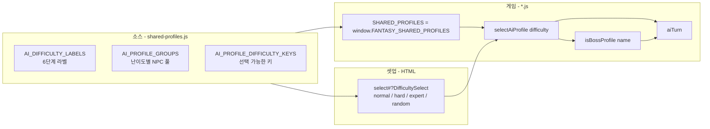

# 🎚️ AI 난이도 & 보스 시스템 (판타지왕국에서 출발한 8개 게임 공통 패턴)

> **용도**: 8개 게임 (fantasy, cant-stop, monopoly, splendor, clue, dominion, tally-ho, sushi-go) 전체의 AI 난이도와 NPC 보스 처리를 일관되게 관리하기 위한 가이드.

판타지왕국(Fantasy Realms 기반)이 출발점이자 가장 깊은 사례이지만, **이 패턴은 8개 게임 모두에 공통으로 적용**됩니다. 새 게임을 만들거나 기존 게임에 합류할 때 참조하세요.

---

## 1. 한눈에 보는 시스템



**핵심 한 줄**:
- NPC 풀은 난이도 그룹별로 미리 묶여 있고 (보통/어려움/매우어려움/보스)
- NPC 이름이 `"강범례"`면 **자동으로 최종보스** 등급이 된다
- `완전랜덤`을 고르면 NPC 풀 전체에서 뽑되 보스가 섞일 수 있다

---

## 2. 난이도 단계 (6단계)

| 키 | 라벨 | 의미 |
|---|---|---|
| `easy` | 쉬움 | 쉬운 휴리스틱 (fanasy가 easy 단계는 추가했지만 1·2·3 인원 게임에선 노출 안 함) |
| `normal` | 보통 | 가벼운 점수 판단 |
| `hard` | 어려움 | 가져오기/버리기 후 예상 점수 비교 |
| `expert` | 매우어려움 | 보너스·패널티·특수 능력까지 깊게 평가 |
| `boss` | 최종보스 | NPC 고정 (강범례 / 변판길 / 제갈혜정) |
| `random` | 완전랜덤 | NPC 풀 전체에서 무작위 + 라벨 '랜덤' |

`shared-profiles.js`가 진실이지만, 각 게임 모듈엔 fallback이 있어서 `shared-profiles.js`가 없어도 동작합니다.

---

## 3. NPC 프로필 구조

```js
const AI_PROFILE_GROUPS = {
  normal: [
    { name: "건일", avatarUrl: profileImageUrl("보통-건일.jpg") },
    { name: "루나", avatarUrl: profileImageUrl("보통-루나.jpg") },
    { name: "케이", avatarUrl: profileImageUrl("보통-케이.jpg") },
    // ...
  ],
  hard: [
    { name: "레이븐", avatarUrl: profileImageUrl("어려움-레이븐.jpg") },
    // ...
  ],
  expert: [
    { name: "강범례", avatarUrl: profileImageUrl("매우어려움-강범례.jpg") },
    // ...
  ],
  boss: [
    { name: "강범례" },
    { name: "변판길" },
    { name: "제갈혜정" }
  ]
};
```

### 3-1. NPC 풀 철칙

- NPC는 한 명당 **한 그룹만** 소속 (중복 없음)
- 등급이 높을수록 강한 전략
- 이름/아바타는 **profileImageUrl 헬퍼** 사용 (UTF-8 인코딩 자동)

### 3-2. 보스 NPC (강범례)

```js
function isBossProfile(profile) {
  return profile?.name === "강범례";
}
```

| 게임 | 위치 | 강범례 처리 |
|---|---|---|
| fantasy | script.js:507 | `profile.boss === true` 면 라벨 "강범례(최종보스)" 강제 |
| cant-stop | cant-stop.js:179 | 동일 패턴 |
| tally-ho | tally-ho.js:198 | 동일 패턴 |

> **명예의 전당**: `script.js` 는 `HALL_OF_FAME_REQUIRED_DIFFICULTY = "random"` 일 때만 격파 기록. 완전랜덤에서 강범례 등장 → 이기면 명예의 전당 등록 ([fantasy.html:163](fantasy.html#L163)).

---

## 4. dialogue (대사) 카테고리 매핑

`dialogues.js` 에서 NPC 이름별로 대사 카테고리를 매핑합니다.

```js
window.FANTASY_DIALOGUE_CHARACTER_BOOKS = {
  "강범례": ["boss"],
  "변판득": ["rough"],
  "변판길": ["rough"],
  "건일":   ["rough"],
  "케이":   ["kind", "rough"],
  "메이":   ["rough"],
  "레이븐": ["rough"],
  // ...
};
```

| 카테고리 | 의미 | 예시 NPC |
|---|---|---|
| `boss` | 최종보스 대사 (격식, 압도) | 강범례 |
| `kind` | 친절/우아 대사 | 유리, 케이, 채춘미 |
| `rough` | 거친/직설 대사 | 건일, 메이, 레이븐 |
| `timid` | 소심/내성 대사 | 유리, 재호, 채호 |

> 새 NPC가 등장하면 `FANTASY_DIALOGUE_CHARACTER_BOOKS`에 한 줄 추가만 하면 자동 연결.

---

## 5. HTML 셋업 패턴

모든 게임의 셋업 `<select>` 는 동일한 tooltip을 공유합니다.

```html
<label class="setup-tooltip"
       data-tooltip="보통: 가벼운 점수 판단. 어려움: 가져오기/버리기 후 예상 점수 비교.
                     매우어려움: 보너스·패널티·특수 선택까지 더 깊게 평가.
                     완전랜덤: 프로필과 실제 난이도가 섞입니다. [게임별 추가 설명]">
  AI 난이도
  <select id="[게임]DifficultySelect">
    <option value="normal">보통</option>
    <option value="hard">어려움</option>
    <option value="expert">매우어려움</option>
    <option value="random">완전랜덤</option>
  </select>
</label>
```

`fantasy.html` 만 보스 설명 문구가 추가됨:

> "강범례는 등장 시 최종보스 난이도로 행동합니다."

---

## 6. JS 모듈에서 불러오는 표준 패턴

모든 게임 모듈 상단에 동일한 import 패턴을 사용합니다.

```js
(function () {
  "use strict";

  // 1) shared 모듈 받아오기
  const SHARED_PROFILES = window.FANTASY_SHARED_PROFILES || {};
  const PROFILE_ASSET_ROOT = SHARED_PROFILES.root || "assets/profiles/user";

  // 2) fallback (shared 가 없을 때)
  const AI_DIFFICULTY_LABELS = SHARED_PROFILES.difficultyLabels || {
    normal: "보통",
    hard: "어려움",
    expert: "매우어려움",
    random: "완전랜덤",
    boss: "최종보스",
  };

  const AI_PROFILE_DIFFICULTY_KEYS = SHARED_PROFILES.difficultyKeys || ["normal", "hard", "expert"];

  const AI_PROFILE_GROUPS = SHARED_PROFILES.groups || {
    normal: [ /* ... 4명 ... */ ],
    hard:   [ /* ... 6명 ... */ ],
    expert: [ /* ... 7명 ... */ ]
  };

  // 3) 헬퍼 함수 정의
  function profileImageUrl(fileName) {
    return encodeURI(`${PROFILE_ASSET_ROOT}/${fileName}`);
  }

  function isBossProfile(profile) {
    return profile?.name === "강범례";
  }

  function aiDifficultyLabel(difficulty) {
    return AI_DIFFICULTY_LABELS[difficulty] || AI_DIFFICULTY_LABELS.normal;
  }

  function randomAiDifficultyKey() {
    return AI_PROFILE_DIFFICULTY_KEYS[
      Math.floor(Math.random() * AI_PROFILE_DIFFICULTY_KEYS.length)
    ] || "normal";
  }

  function selectAiProfile(difficulty, indexHint) {
    if (difficulty === "random") {
      // 풀 전체에서 뽑기 + 강범례 등장 가능
      const pool = AI_PROFILE_DIFFICULTY_KEYS.flatMap(
        k => AI_PROFILE_GROUPS[k] || []
      );
      return prepareAiProfile(
        pool[Math.floor(Math.random() * pool.length)],
        randomAiDifficultyKey(),
        "랜덤"
      );
    }
    const group = AI_PROFILE_GROUPS[difficulty] || [];
    return prepareAiProfile(
      group[indexHint % group.length],
      difficulty
    );
  }

  function prepareAiProfile(profile, difficulty, labelOverride = null) {
    const boss = isBossProfile(profile);
    return {
      ...profile,
      boss,
      difficulty: boss ? "boss" : difficulty,
      difficultyLabel: boss
        ? AI_DIFFICULTY_LABELS.boss
        : (labelOverride || aiDifficultyLabel(difficulty))
    };
  }

  // 4) 닉네임 / 인간 프로필도 동일 패턴
  const HUMAN_PROFILE = SHARED_PROFILES.human || {
    name: "나",
    avatarUrl: profileImageUrl("유저.jpg")
  };
})();
```

**이 패턴을 쓰면 `shared-profiles.js` 한 번만 수정해도 8개 게임 전체가 자동 반영**됩니다.

---

## 7. 새 게임에 적용하는 체크리스트

### 7-1. 셋업 HTML (3분)

- `[게임].html` 안 `setup-controls` 안에 위 5번의 select 패턴 복사
- `id="[게임]DifficultySelect"` 로 고유 id 부여
- tooltip 텍스트의 "[게임별 추가 설명]" 자리에 게임 고유 문구 (예: fantasy 는 강범례 멘트)
- `selectAiProfileDifficulty` 변경 시 호출하는 단일 함수에 매핑

### 7-2. 셸 (5분)

- `[게임].html` `<head>` 에 `setup-shell.css`, `setup-shell.js` 추가
- `<body>` 가장 위에서 `shared-profiles.js` 로드 (이미 다른 파일에서 로드 중이면 그대로)

```html
<script src="shared-profiles.js?v=lock-step"></script>
<script src="setup-shell.js?v=local-preview"></script>
<script src="shared-ui.js?v=common-chrome"></script>
```

### 7-3. 게임 모듈 (5분)

- 게임 모듈 상단에 6번 표준 패턴 복사
- 인라인 NPC 풀 코드는 **전부 제거** (shared 가 fallback 으로 처리)
- AI 행동 함수에서 `difficulty` 값으로 분기 (간단한 휴리스틱은 그대로, 깊은 평가는 게임 패턴에 맞춰 추가)

### 7-4. 보스 / 대사 연결 (5분)

- 게임 특유의 **보스 룰**이 있다면 `isBossProfile(profile)` 결과로 분기:
  - 예: fantasy → 보스 점수 가중치 1.5배, 익스퍼트 대사 출현 빈도 2배
  - 예: tally-ho / cant-stop → 보스는 무조건 알파 전략만
- `dialogues.js` 의 `FANTASY_DIALOGUE_CHARACTER_BOOKS` 에 새 게임의 NPC 가 있으면 카테고리 추가

### 7-5. 검수

- [ ] 셀렉트에서 "보통 → 어려움 → 매우어려움 → 완전랜덤" 변경 시 NPC 풀 바뀌는지
- [ ] 이름이 "강범례" 인 NPC 등장 시 라벨이 "강범례(최종보스)" 로 보이는지
- [ ] 완전랜덤 → 보스 포함 NPC 등장 확인
- [ ] shared-profiles.js 만 변경하고 게임 모듈 코드 건드리지 않아도 NPC 갱신되는지 (재로드로 검증)

---

## 8. 디자인 결정 노트

### 8-1. 왜 이름 기반(`"강범례"`)으로 보스를 식별하나?

| 방식 | 장점 | 단점 |
|---|---|---|
| ✅ 이름 기반 (현재) | 코드 한 줄로 식별, NPC 이미지/대사가 보스와 자연 연결 | "강범례" 이름 변경 시 깨짐 |
| `profile.boss` boolean | 명시적 의도 표현 | 모든 NPC 등록 시 수동 설정 필요 |
| 별도 groups.boss | 가장 명확 | 새 그룹을 모든 모듈에 추가 동기화해야 함 |

→ **다중 게임 단일 소스 + 한 줄 식별** 트레이드오프에서 이름이 가장 가성비 좋았음

### 8-2. 왜 보스는 NPC 풀 안에 있나?

`expert` 의 일부가 보스로 승격되는 게 아니라 **별도 풀**에 둬서 의도 강조:
- `expert` 풀은 휴리스틱 깊이만 다른 일반 NPC
- `boss` 풀은 "이 게임을 클리어한 자" 한 명 격파 가능한 위협
- 사용자는 셀렉트에서 "완전랜덤" 만 골라도 보스 출현 확률 존재 → **서프라이즈 요소**

### 8-3. 왜 4단계만 셀렉트에 노출하나?

`easy` / `boss` 는 셋업에서 선택 불가:
- `easy` → 사용자가 직접 easy 그룹에서 뽑는 일이 거의 없고, 보스가 등장하지 않으니 게임별로 노출 가치 다름
- `boss` → 명시적으로 보스전을 고르는 건 별도 UI 가 필요 (퀘스트 모드, 일일 도전 등)

현재는 둘 다 셸(fallback) 용도로만 존재.

---

## 9. 향후 확장 아이디어

| 확장 | 추가 비용 | 게임 노리 |
|---|---|---|
| 일일 도전 NPC | `dailyChallengeChallenge()` 함수 1개 + 랭킹 컬럼 | daily seed 기반 강범례/특수 NPC |
| 시즌제 보스 격파 카운터 | supabase 테이블 1개 + `kill_count` 컬럼 | 격파 횟수 → 명예의 전당 칩 |
| 보스 격파 보상 칩 | victory 조건 +1 | 코인/스킨/타이틀 |
| NPC 스킨 (같은 이름 다른 이미지) | `skins/[name]_[skin].jpg` | 시즌제 비주얼 |
| 4인장 확장 (각 게임 한 NPC 만 추가) | 그룹 1줄 + 이미지 4개 | 더 큰 게임별 풀 |

> 새 시스템 추가 시 `shared-profiles.js` 는 **읽기 전용**으로 유지하고 게임 모듈에 확장 함수를 추가하는 방향을 추천.

---

## 10. 참조 파일

| 종류 | 파일 |
|---|---|
| 단일 소스 | [shared-profiles.js](../shared-profiles.js) |
| 판타지왕국 | [script.js](../script.js#L270-L320), [fantasy.html](../fantasy.html#L63-L73) |
| 칸트스탑 | [cant-stop.js](../cant-stop.js#L40-L200) |
| 탈리호 | [tally-ho.js](../tally-ho.js#L82-L198) |
| 클루/도미니온/스플렌더/모노폴리/스시고 | `clue.js`, `dominion.js`, `splendor.js`, `monopoly.js`, `sushi-go.js` (모두 동일 패턴) |
| NPC 대사 매핑 | [dialogues.js](../dialogues.js#L929-L949) |
| 명예의 전당 (판타지 전용) | [script.js:1274-1520](../script.js#L1274-L1520) |
| 셸 | [setup-shell.js](../setup-shell.js) |

> 새 게임 추가 시 위 참조 목록에 한 줄 더 적어두세요.

---

**마지막 업데이트**: 2026-07-15
**유지**: 판타지왕국 패턴의 일관성 (shared-profiles.js ↔ 모든 게임 모듈)
